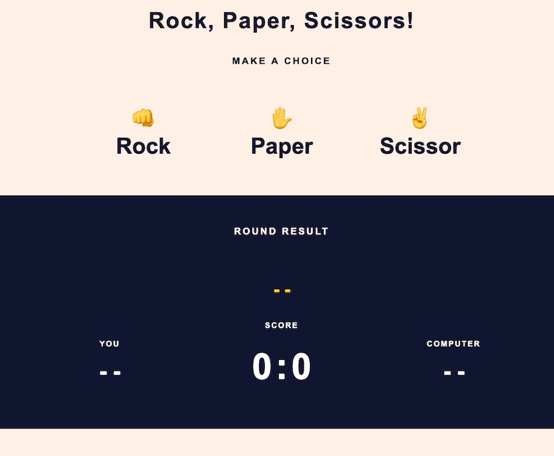
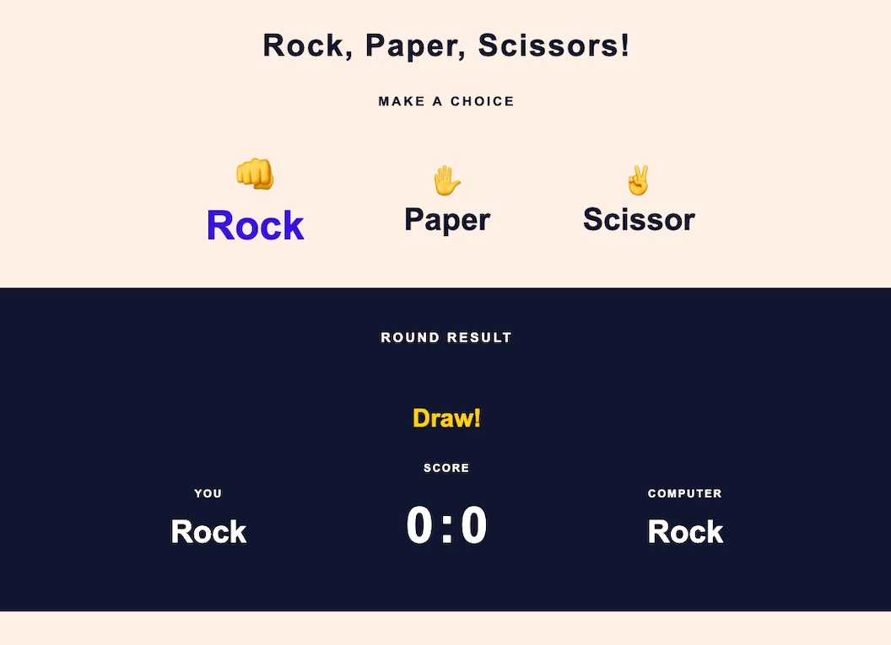
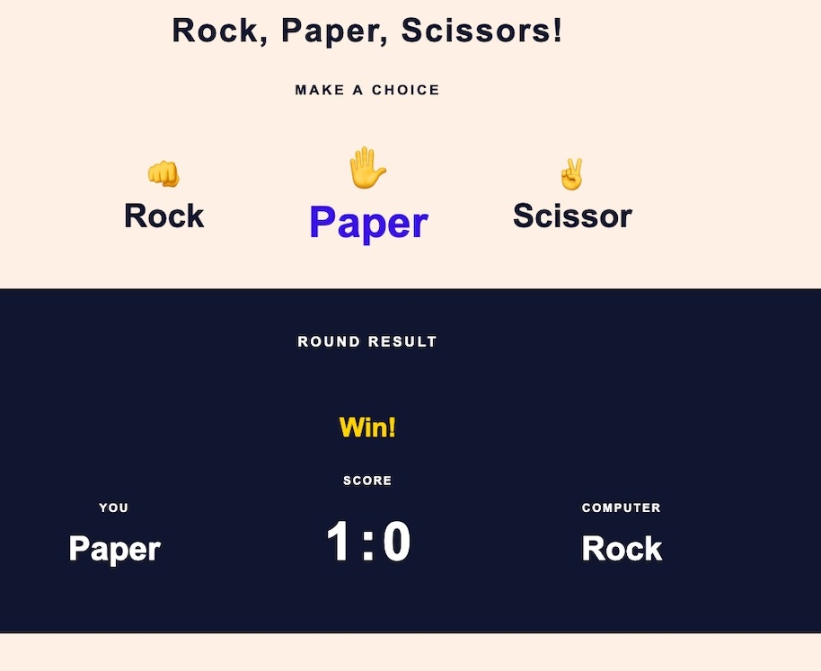
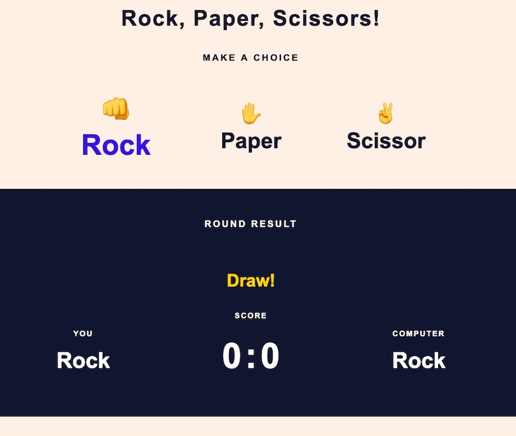

# Rock Paper Scissor 
## This project is a game everyone knows! 
### This website is a easy way for one player to play against the computer.
### It's meant to be easy to play, and with an overview that makes it easy to keep track who first gets to 5 wins!

## Live page
The live website can be found here; [RockpaperScissor](https://jessicafransson.github.io/project2-rock-paper-scissor/?)

## Multidevice Mockup

# UX

## Before creating this game i first went into Figma to draw up a sketch.
### This is the layout i was working towards:

 
## About

* This setup is meant to be easy to use
* This setup is designed so that its quick to start playing
* This setup is meant to be easy to play on all devices. 

# Features

## These are the different sections of the game: 

## This is how it looks before you start playing:

## The emoji is clearly marked when chosen: 

## If you win a round you get this message:

## If you lose a round you get this message: 

## If the round is a draw you get this message:

## If you win 5 rounds before the computer, you see this message:

## If the computer wins 5 rounds, you see this message:

## The rules are displayed at the bottom of the page: 

## Technologies Used
* Figma for mockup
* Github for deploying the website
* Gitpod to edit and structure the website
* HTML to provide the structure and content for the website
* CSS to style the website
* JavaScript for the interactivity 

# Testing 

## HTML testing 

### Document checking completed. No errors or warnings to show.

## CSS testing

### Congratulations, no errors has been found! This document has been validated as CSS Level 3 + SVG!

## Javascript

### JSHint testing without errors

## Accessibility

### tested for accessibility with following score

## Devices

### The game has been tested without errors on:
### Iphone 13 Pro
### Samsung s20
### Iphone xs
### Samsung s10+

# Future improvements

## How to further develop this website

### I would add a random player to be played against online
###  I would add Lizard Spock to further develop the game to more advanced.

## Deployment

### How i deployed the project:
* This site is deployed to GitHub Pages, i followed these steps:
    * Go to the GitHub repository, and the settings tab
    * Navigate to the Pages on the left side
    * Under the source file, select the branch to 'main' and then save
    * Once you've selected the 'main' branch, the page will automatically be refreshed with a successful deployment!

## Credits

* ### Inspiration
* inspiration for JavaScript from GeekForGeeks: (https://www.geeksforgeeks.org/rock-paper-and-scissor-game-using-javascript/)
* Inspiration from our awesome Slack community, also amazing support and ideas during the development of this project.
* Inspiration from Youtube video: (https://www.youtube.com/watch?v=1yS-JV4fWqY)
* Inspiration and code from YouTube: (https://www.youtube.com/watch?v=RwFeg0cEZvQ)
* Ideas and inspiration from w3schools: (https://www.w3schools.com/)
* Inspiration for CSS from my project one

* ### Content
* Fonts from: Fonts: (https://fonts.googleapis.com/css2?family=Lato:wght@300;700&display=swap)
* Color scheme from: ColorHex (https://www.color-hex.com/color-palette/1016582)
* Testing code in playcode: https://playcode.io/javascript/
* Logos from Fontawesome: (https://fontawesome.com/icons/laptop?s=solid)
* Emojis from (https://getemoji.com/)

## Acknowledgements
Rock Paper Scissor is my Project two for the Full Stack Software Developer program with [CodeInstitute] (https://codeinstitute.net/). 

### **Jessica Fransson, 2022**
